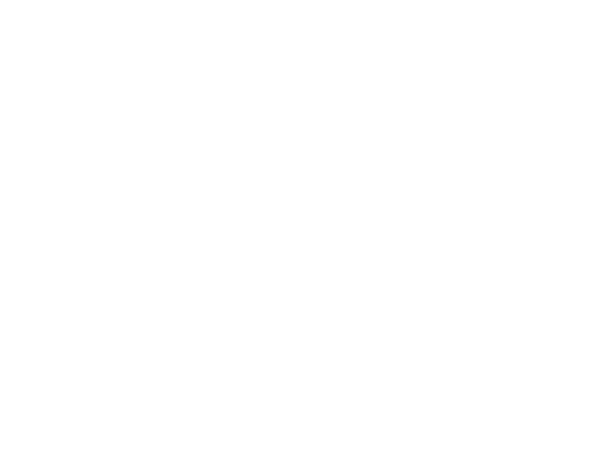
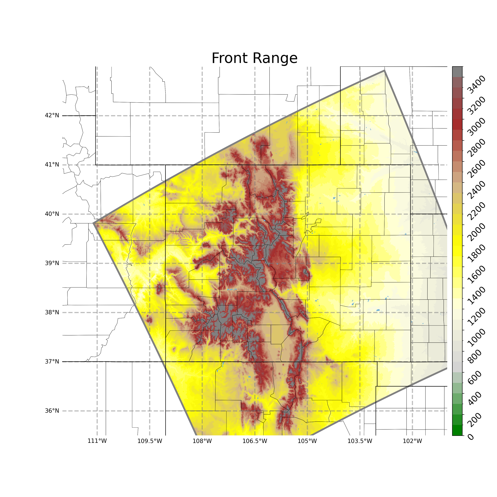
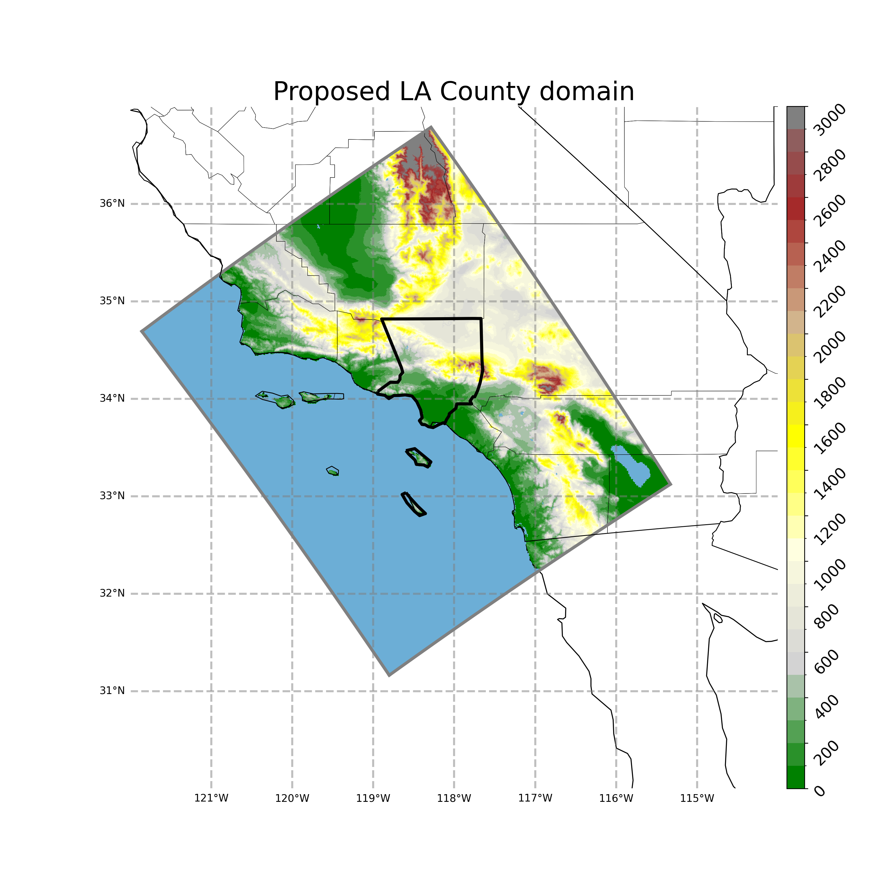
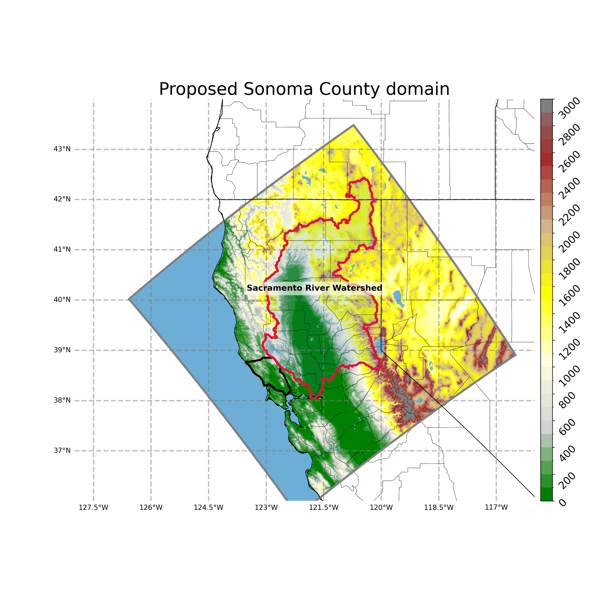

# WUS-LES

WRF/WPS configuration and source-code modifications used for the WUS-LES
regional modeling experiments.

## Model domains

### Full domain configuration

### Colorado domains

### Southern California domains

### Sonoma domains

## Model software

- WRF version: 4.8.0
- WPS version: 4.6.0
- Platform: NSF NCAR Derecho
- Original installation:
  `/glade/derecho/scratch/srahimi/wrf480`

Compiled objects, executables, runtime output, forcing data, static geography
data, and large NetCDF/GRIB files are not included in this repository.
EOF
